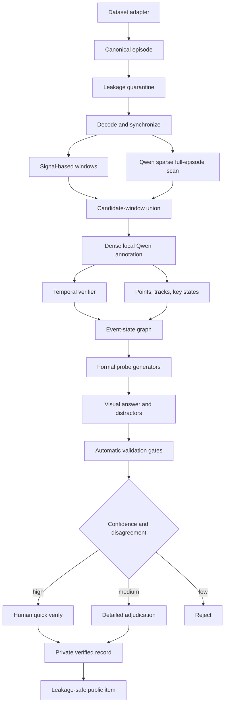
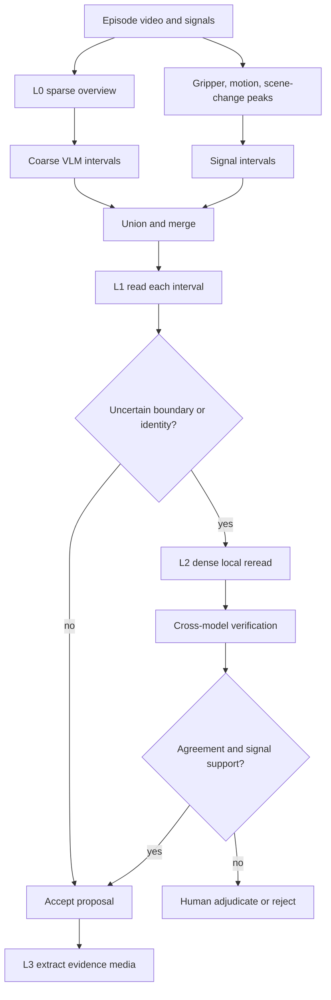

# MemProbe: Open-Source Long-Video VLM Data Generation Pipeline

Status: design proposal  
Last reviewed: 2026-06-19

This document specifies a dataset-independent pipeline for generating MemProbe
items from robot videos. Open-weight video-language models are annotation
assistants. Their output is a proposal, never benchmark ground truth by itself.

Related documents:

- [Working research ideas](main.md)
- [Sixteen probe families](probe_question_catalog.md)
- [Long-video literature notes](../design_docs/long_video_understanding.md)

## 1. Decision

Use a coarse-to-fine, multi-model pipeline:

1. Scan the full episode sparsely.
2. Merge VLM proposals with robot-signal and visual-change windows.
3. Re-read candidate windows densely.
4. Build object tracks and event/state atoms.
5. Generate formal probes from verified atoms.
6. Build answers and distractors from source media.
7. Run automatic gates and human verification.

Recommended roles:

| Role | Default | Purpose |
| --- | --- | --- |
| Event proposer | Qwen3-VL-8B-Instruct | Whole-video scan and timestamped event proposals |
| Stable fallback | Qwen2.5-VL-7B-Instruct | Mature video and structured-output tooling |
| Spatial grounder | Molmo2-8B | Object pointing, tracking, and visibility |
| Temporal verifier | VideoLLaMA3-7B | Independent local-clip interpretation |
| Spatial verifier | InternVL3.5-8B | High-resolution keyframe and crop inspection |
| Extreme-context reader | LongVILA-7B | Optional whole-episode retrieval |
| Truth authority | Deterministic checks plus humans | Prevent hallucinated labels |

A one-hour VLM call is not sufficient. Long context means that the input can fit;
it does not guarantee that sparse sampling observes a brief grasp, release,
contact, or occlusion.

## 2. Annotation and Evaluation Are Different Protocols

During offline annotation, a VLM may receive timestamp overlays, private frame
IDs, robot state, gripper state, repeated clips, and a task-specific annotation
prompt.

During MemProbe evaluation, the primary protocol remains:

```text
visual history -> history stops -> formal probe + visual choices -> choice ID
```

Evaluation media must not expose evidence markers, source task names, private
timestamps, or generated descriptions. The episode-specific query is revealed
only after the evaluated memory system has encoded the history.

## 3. Open-Model Survey

The following are official self-reported capabilities. Results from different
papers are not directly comparable unless media, sampling, prompt, and scoring
are identical.

### 3.1 Qwen3-VL

The [technical report](https://arxiv.org/abs/2511.21631) and
[official repository](https://github.com/QwenLM/Qwen3-VL) provide:

- dense 2B, 4B, 8B, and 32B models plus MoE variants;
- native 256K multimodal context and optional YaRN extension toward 1M;
- interleaved MRoPE for spatial-temporal position modeling;
- text-timestamp alignment for temporal grounding;
- video fps, num_frames, and total visual-pixel budget controls;
- Transformers, vLLM, and SGLang inference paths.

The official processor defaults to 2 FPS. The repository also recommends a
bounded total video pixel budget. Nominal duration support therefore does not
imply dense temporal coverage.

**MemProbe role:** primary event proposer and timestamp localizer. Prefer the
Instruct model for deterministic JSON. Use Thinking only for difficult
adjudication.

### 3.2 Qwen2.5-VL

The [technical report](https://arxiv.org/abs/2502.13923) and
[official release](https://qwenlm.github.io/blog/qwen2.5-vl/) describe videos
longer than one hour, absolute-time encoding, second-level event localization,
visual grounding, and structured output.

**MemProbe role:** mature fallback and reproduction baseline. It must not certify
its own proposals.

### 3.3 Molmo2

The [paper](https://arxiv.org/abs/2601.10611) and
[official code](https://github.com/allenai/molmo2) release model weights,
training code, and training data. Molmo2 explicitly supports video pointing and
tracking. Its released long-context recipe uses 36K-plus sequences and up to
384 frames.

**MemProbe role:** object-instance points, tracks, visibility spans, and spatial
verification rather than arbitrary-duration scanning.

### 3.4 VideoLLaMA3

The [paper](https://arxiv.org/abs/2501.13106) and
[official repository](https://github.com/DAMO-NLP-SG/VideoLLaMA3) release 2B and
7B models. The visual frontend supports variable resolution and compresses
video tokens according to visual similarity. The inference interface exposes
fps and max_frames, and the cookbook includes temporal grounding.

**MemProbe role:** temporal second opinion on local clips. Similarity compression
may suppress low-salience state changes, so it cannot own fine boundaries.

### 3.5 InternVL3.5

The [paper](https://arxiv.org/abs/2508.18265) and
[official repository](https://github.com/OpenGVLab/InternVL) release models from
roughly 1B to 241B-A28B. The reference video path uniformly samples and
dynamically tiles frames, presenting them as Frame-1, Frame-2, and so on.

**MemProbe role:** high-resolution keyframe and crop verification, not
metric-time truth.

### 3.6 LongVILA and LongVA

The [LongVILA paper](https://arxiv.org/abs/2408.10188) reports extending VILA
from 8 to 2,048 input frames and 99.8% retrieval on a 6,000-frame
needle-in-a-haystack test. [LongVA](https://github.com/EvolvingLMMs-Lab/LongVA)
targets 2,000 frames or more than 200K visual tokens.

**MemProbe role:** optional extreme-context retrieval. Needle retrieval does not
demonstrate reliable understanding of subtle robot-action boundaries.

## 4. Capability Comparison

| Model | Long scan | Time grounding | Spatial grounding | Tracking | Role |
| --- | --- | --- | --- | --- | --- |
| Qwen3-VL | strong | strong | strong on keyframes | usable | Primary proposer |
| Qwen2.5-VL | strong | strong | strong on keyframes | usable | Stable fallback |
| Molmo2 | usable | usable | strong | strong | Track verifier |
| VideoLLaMA3 | usable | usable | usable | weak | Temporal verifier |
| InternVL3.5 | sampled frames | weak for metric time | strong | weak | Spatial verifier |
| LongVILA/LongVA | strong but expensive | usable | limited | weak | Extreme retrieval |

No model provides dense long-duration coverage, reliable identity tracking,
precise event boundaries, and low cost simultaneously.

## 5. System Flow



## 6. Multi-Scale Reading

Starting values for real-robot videos:

| Level | Purpose | Sampling | Product |
| --- | --- | --- | --- |
| L0 | Episode overview | 0.5 FPS | Coarse event windows |
| L1 | Manipulation phases | 2 FPS in windows | Refined intervals |
| L2 | Contact and occlusion boundaries | 8 FPS or source FPS | Start/peak/end |
| L3 | Ground-truth media | Original selected frames | Crops, tracks, choices |



Rules:

- Preserve decoder presentation timestamps; never infer truth from nominal FPS.
- Burn timestamps into private annotation copies only.
- Use overlapping chunks around chunk boundaries.
- Store exact sampled frame indices for every model call.
- Increase density only for uncertain windows, not the whole episode.
- Preserve clean media derivatives for benchmark export.
